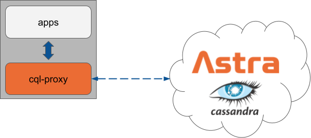

# cql-proxy

[](https://github.com/datastax/cql-proxy/actions/workflows/test.yml) [](https://goreportcard.com/report/github.com/datastax/cql-proxy)

A CQL proxy/sidecar. It listens on a local address and securely forwards your application's CQL traffic.

**Note**: `cql-proxy` in its current state works well, but it is still under development. That means
that things might break or change. Please give it a try and let us know what you think!



## Getting started

```sh
go build
```

Run against a [DataStax Astra][astra] cluster:

```sh
./cql-proxy --bundle <your-secure-connect-zip> \
  --username <astra-client-id> --password <astra-client-secret>
```

or using Docker as

```sh
docker run -v <your-secure-connect-bundle.zip>:/tmp/scb.zip -p 9042:9042 \
  --rm datastax/cql-proxy:v0.0.4 \
  --bundle /tmp/scb.zip --username <astra-client-id> --password <astra-client-secret>
```

`<astra-client-id>` and `<astra-client-secret>` can be generated using these [instructions].

Run against a Apache Cassandra cluster:

```sh
./cql-proxy --contact-points <cluster node IPs or DNS names>
```

or using Docker as

```sh
docker run -p 9042:9042 \
  --rm datastax/cql-proxy:v0.0.4 \
  --contact-points <cluster node IPs or DNS names>
```


or using Kubernetes as below. Check the k8s folder for `config` and `cql-proxy.yaml` and more documentation.

```sh
kubectl create -f cql-proxy.yaml
```

## When to use `cql-proxy`

The main use for `cql-proxy` is to enable unsupported CQL drivers and existing applications to work
well with [DataStax Astra][astra]. Unsupported CQL drivers include legacy [DataStax
drivers][drivers] and non-Datastax, community maintained CQL drivers (including [gocql],
[rust-driver], etc.). 

`cql-proxy` also enables applications that are currently using [Apache Cassandra][cassandra] or
[DataStax Enterprise (DSE)][dse] to use Astra without requiring any code changes.  Your application
just needs to be configured to use the proxy.

If you're building a new application using [DataStax drivers][drivers] then those should be used to
communicate directly with Astra. They have excellent support for Astra out-of-the-box. To use a
DataStax driver with Astra follow [this][driver-guide] guide.

## Configuration

To pass configuration to the cql-proxy both command line flags and environment variables can be used. Below are examples of
the same command using both methods

Flags

```sh
docker run -v <your-secure-connect-bundle.zip>:/tmp/scb.zip -p 9042:9042 \
  --rm datastax/cql-proxy:v0.0.2 \
  --bundle /tmp/scb.zip --username <astra-client-id> --password <astra-client-secret>
```

Environment Variables

```sh
docker run -v <your-secure-connect-bundle.zip>:/tmp/scb.zip -p 9042:9042  \
  --rm datastax/cql-proxy:v0.0.2 \
  -e BUNDLE=/tmp/scb.zip -e USERNAME=<astra-client-id> -e PASSWORD=<astra-client-secret>
```

To see what options are available the `-h` flag will display a help message listing all flags and their corresponding descriptions
and environment variables

```sh
$ ./cql-proxy -h
Usage: cql-proxy

Flags:
  -h, --help               Show context-sensitive help.
  -b, --bundle=STRING      Path to secure connect bundle ($BUNDLE)
  -u, --username=STRING    Username to use for authentication ($USERNAME)
  -p, --password=STRING    Password to use for authentication ($PASSWORD)
  -c, --contact-points=CONTACT-POINTS,...
                           Contact points for cluster. Ignored if using the bundle path
                           option ($CONTACT_POINTS).
  -a, --bind=STRING        Address to use to bind serve ($BIND)
      --debug              Show debug logging ($DEBUG)
      --profiling          Enable profiling ($PROFILING)
```

[astra]: https://astra.datastax.com/
[instructions]: https://docs.datastax.com/en/astra/docs/manage-application-tokens.html
[gocql]: https://github.com/gocql/gocql
[rust-driver]: https://github.com/scylladb/scylla-rust-driver
[driver-guide]: https://docs.datastax.com/en/astra/docs/connecting-to-astra-databases-using-datastax-drivers.html
[cassandra]: https://cassandra.apache.org/
[dse]: https://www.datastax.com/products/datastax-enterprise
[drivers]: https://docs.datastax.com/en/driver-matrix/doc/driver_matrix/common/driverMatrix.html
